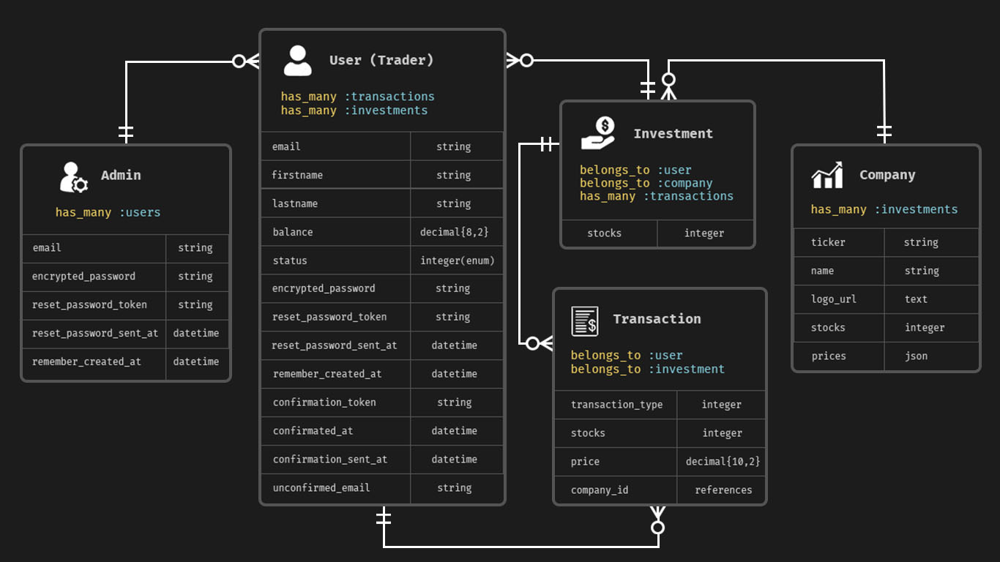

# Stock Trading App

[Avion School](https://www.avionschool.com/) 2nd backend project using ruby on rails.

## User Stories

- As a Trader, I want to create an account to buy and sell stocks.
- As a Trader, I want to log in my credentials so that I can access my account on the app.
- As a Trader, I want to buy a stock to add to my investment(Trader signup should be approved).
- As a Trader, I want to have a My Portfolio page to see all my stocks.
- As a Trader, I want to have a Transaction page to see and monitor all the  transactions made by buying and selling stocks.
- As a Trader, I want to sell my stocks to gain money.
- As an Admin, I want to create a new trader to manually add them to the app.
- As an Admin, I want to edit a specific trader to update his/her details.
- As an Admin, I want to view a specific trader to show his/her details.
- As an Admin, I want to see all the trader that registered in the app so I can track all the traders.
- As an Admin, I want to see all the transactions so that I can monitor the transaction flow of the app.

## Entity Relationship Diagram

## User Flow Diagram

## Technologies
- Ruby v3.0.2
- Rails v7.0.2
- NodeJS v16.14.0
- Yarn 1.22
- PostgreSQL v14.2
- Heroku CLI v7.59.4

## Gems 
- pg
- devise
- cancancan
